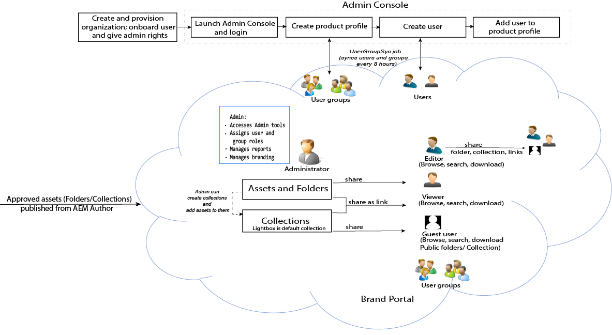

# Guia do Adobe Experience Manager Assets Brand Portal {#aem-brand-portal}

**Marca do Adobe Experience Manager Assets** As organizações Portalaid atendem às suas necessidades de marketing, distribuindo com segurança os ativos de marca e produto aprovados a agências externas, parceiros, equipes internas e revendedores para download.

A falta de uma solução de compartilhamento de ativos seguros pode resultar em:

* Compartilhamento manual de ativos por e-mail ou nuvem
* Problemas de conformidade da marca
* Falta de controle sobre o uso dos ativos
* Atraso nas campanhas e lançamentos de produtos
* Duplicação de conteúdo em localizações e organizações geográficas
* Armazenamento inseguro de ativos antes do lançamento

Com o Brand Portal, as organizações podem garantir conformidade à marca permitindo que os vendedores colaborem com parceiros do canal e usuários de negócios internos para rapidamente criar, gerenciar e fornecer as orientações, logotipos, campanhas e ativos de produtos mais recentes para os participantes.
Brand Portal é uma oferta SAAS baseada em nuvem. Ele está disponível como add-on ao produto Adobe Experience Manager Assets (no local ou serviço gerenciado).

O fluxo de trabalho da solução Brand Portal está ilustrado na imagem a seguir.

## Guia do usuário Adobe Experience Manager Brand Portal

Este guia do usuário documenta insights para ofertas e fluxos de trabalho principais do Brand Portal. Use o painel à esquerda para navegar pelas várias funcionalidades e vá para baixo para conhecer como pessoas diferentes interagem com o portal.

### Consulte também:

| Guia do usuário | Descrição |
|--- |---|
| [Novidades](whats-new.md) | O que mudou e ofertas mais recentes no Brand Portal através de lançamentos anteriores. |
| [Notas de lançamento](brand-portal-release-notes.md) | Aprimoramentos, problemas críticos corrigidos e problemas conhecidos na versão atual. |
| [Configurar o Experience Manager Assets com o Brand Portal](../using/configure-aem-assets-with-brand-portal.md) | Como replicar o Brand Portal com o Experience Manager Assets para publicar ativos. |
| [Solucionar problemas na publicação paralela](troubleshoot-parallel-publishing.md) | Solucione problemas de replicação entre o Brand Portal e o Experience Manager Assets. |
| [Formatos de arquivo não suportados](brand-portal-supported-formats.md) | Formatos de arquivo suportados no Brand Portal para visualização e download. |
| [Publicar ativos no Brand Portal](brand-portal-sharing-folders.md) | Como publicar pastas, coleções, links, predefinições, esquema, aspectos e tags no Brand Portal. |
| [Origem de ativos no Brand Portal](brand-portal-asset-sourcing.md) | Como configurar a origem dos ativos no AEM Assets, faça upload dos ativos no Brand Portal e publique a pasta de contribuição de volta no AEM Assets. |

### Recursos úteis

* [Noções básicas do Brand Portal com o AEM Assets](https://experienceleague.adobe.com/docs/experience-manager-brand-portal/using/home.html)
