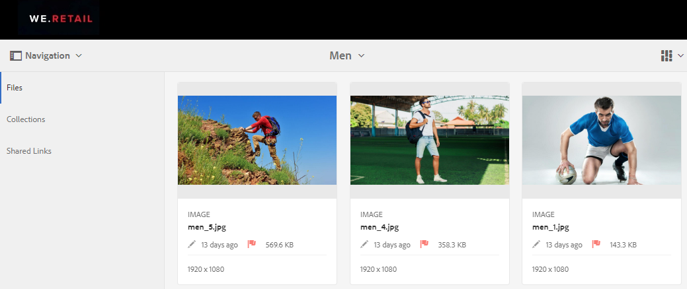
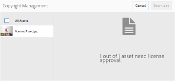
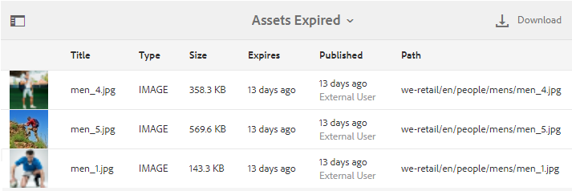

# Gerenciar direitos digitais dos ativos {#manage-digital-rights-of-assets}

Garantir a distribuição e uso seguros dos ativos criativos e do material da marca é essencial para proteger sua marca. Isso pode ser aplicado dentro e fora da organização, associando uma data de expiração (e hora) aos ativos aprovados publicados do AEM para a Brand Portal ou licenciando esses ativos para uso condicional. Além disso, o Brand Portal permite especificar uma data de expiração para os links para os ativos compartilhados do Brand Portal.

Leia para saber como os ativos são protegidos no Brand Portal e compreender as permissões de uso associadas.

## Expiração do ativo {#asset-expiration}

A expiração de ativos é uma maneira eficaz de controlar o uso de ativos aprovados na Brand Portal em uma organização. Todos os ativos publicados do AEM Assets para o Brand Portal podem ter uma data de expiração, o que restringe o uso desses ativos por diferentes funções de usuário.

### Permissões de uso relacionadas a ativos expirados {#usage-permissions-expired-assets}

No Brand Portal, os administradores podem exibir, baixar e adicionar ativos expirados às coleções. Enquanto isso, os Editores e Visualizadores só podem exibir e adicionar ativos expirados às coleções.

Os administradores podem publicar ativos expirados do AEM Assets para o Brand Portal. No entanto, os ativos expirados não podem ser compartilhados por meio do link da Brand Portal. Se você selecionar qualquer ativo expirado de uma pasta contendo ativos expirados e não expirados, a ação **[!UICONTROL Compartilhar link]** não estará disponível. Mas, se você selecionar uma pasta que contém ativos expirados e não expirados, as ações [!UICONTROL Compartilhar] e **[!UICONTROL Compartilhar link]** estarão disponíveis.

>[!NOTE]
>
>Uma pasta ainda pode ser compartilhada como um link, mesmo que contenha ativos expirados. Nesse caso, o link não lista os ativos expirados e apenas os ativos não expirados são compartilhados.

A tabela a seguir exibe as permissões de uso de ativos expirados:

|  | **[!UICONTROL Compartilhamento de link]** | **[!UICONTROL Download]** | **[!UICONTROL Propriedades]** | **[!UICONTROL Adicionar à coleção]** | **[!UICONTROL Excluir]** |
|---|---|---|---|---|---|
| **[!UICONTROL Administrador]** | Indisponível | Disponível | Disponível | Disponível | Disponível |
| **[!UICONTROL Editor]** | Indisponível | Indisponível | Disponível | Disponível | Indisponível |
| **[!UICONTROL Visualizador]** | Indisponível | Indisponível | Disponível | Disponível | Indisponível |
| **[!UICONTROL Usuário convidado]** | Indisponível | Indisponível | Disponível | Disponível | Indisponível |

>[!NOTE]
>
>Se Visualizadores e Editores baixarem uma pasta contendo ativos expirados e não expirados, somente os ativos não expirados serão baixados. Se uma pasta contiver somente ativos expirados, uma pasta vazia será baixada.

### Status de expiração dos ativos {#expiration-status-of-assets}

Você pode visualizar o status de expiração dos ativos em sua **[!UICONTROL Exibição de cartão]**. Um sinalizador vermelho no cartão indica que o ativo expirou.

>[!NOTE]
>
>As exibições Lista e Coluna não exibem o status de expiração dos ativos.

## Expiração do link do ativo {#asset-link-expiration}

Ao compartilhar ativos por meio de links, Administradores e Editores podem definir uma data e hora de expiração usando o campo **[!UICONTROL Expiration]** na caixa de diálogo **[!UICONTROL Compartilhamento de link]**. A expiração padrão do link é de sete dias a partir da data em que o link é compartilhado.

Isso garante que os ativos compartilhados como links expirem na data e hora definidas pelos administradores e editores do Brand Portal, e não podem mais ser visualizados e baixados além da data de expiração. Como os ativos compartilhados por meio de links também podem ser visualizados por usuários externos que não fazem parte da organização, ao especificar a expiração, você pode garantir que seus ativos aprovados estejam protegidos e não sejam expostos a entidades desconhecidas além de um tempo especificado.

Para obter mais informações sobre o compartilhamento de links, consulte [Compartilhar ativos como um link](../using/brand-portal-link-share.md).

## Ativos licenciados {#licensed-assets}

Os ativos licenciados estão sujeitos à aceitação de um contrato de licença antes do download da Brand Portal. Este contrato para ativos licenciados vem quando você baixa diretamente o ativo da Brand Portal ou por meio de um link compartilhado. Independentemente de expirar ou não, os ativos protegidos por licença podem ser visualizados por todos os usuários. No entanto, o download e o uso de ativos licenciados expirados são limitados. Para saber mais sobre o comportamento de ativos licenciados expirados e atividades permitidas com base em funções de usuário, consulte [permissões de uso de ativos expirados](../using/manage-digital-rights-of-assets.md#usage-permissions-expired-assets).

Os ativos protegidos por licença têm [contrato de licença anexado](https://experienceleague.adobe.com/docs/experience-manager-65/assets/administer/drm.html) a eles, o que é feito definindo a [propriedade de metadados](https://experienceleague.adobe.com/docs/experience-manager-65/assets/administer/drm.html) do ativo no AEM Assets.

Se optar por baixar ativos protegidos por licença, você será redirecionado para a página **[!UICONTROL Gerenciamento de direitos autorais]**.

Aqui, é necessário selecionar o ativo para baixar e aceitar o contrato de licença associado. Se você não aceitar o contrato de licença, o botão **[!UICONTROL Download]** não será ativado.

Se a seleção contiver vários ativos protegidos, selecione um ativo de cada vez, aceite o contrato de licença e continue para baixar o ativo.

## Gerar relatório sobre ativos expirados {#generate-report-about-expired-assets}

Os administradores podem gerar e baixar um relatório listando todos os ativos expirados em um período específico. Este relatório inclui informações detalhadas— como tamanho, tipo, caminho que especifica a localização do ativo na hierarquia do ativo, quando o ativo venceu e quando o ativo foi publicado— sobre os ativos expirados. As colunas desse relatório podem ser personalizadas para exibir mais dados com base nos requisitos do usuário.

Para obter mais informações sobre o recurso de relatórios, consulte [Trabalhar com relatórios](../using/brand-portal-reports.md#work-with-reports).
