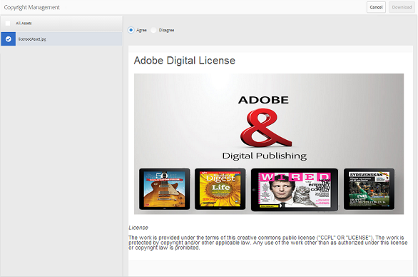

# Gerenciar direitos digitais dos ativos {#manage-digital-rights-of-assets}

Garantir a distribuição e o uso seguros dos ativos criativos e do material da marca é vital para proteger sua marca. Isso pode ser aplicado em toda a organização e fora dela, associando uma data de expiração (e hora) aos ativos aprovados publicados do AEM para a Brand Portal ou licenciando esses ativos para uso condicional. Além disso, o Brand Portal permite especificar uma data de expiração para os links para os ativos compartilhados da Brand Portal.

Leia para saber como os ativos estão protegidos no Brand Portal e entender as permissões de uso associadas.

## Expiração do ativo {#asset-expiration}

A expiração de ativos é uma maneira eficaz de controlar o uso de ativos aprovados no Brand Portal em uma organização. Todos os ativos publicados do AEM Assets para o Brand Portal podem ter uma data de expiração, o que restringe o uso desses ativos por diferentes funções de usuário.

### Permissões de uso relacionadas a ativos expirados {#usage-permissions-expired-assets}

No Brand Portal, os administradores podem visualizar, baixar e adicionar ativos expirados às coleções. Ao passo que Editores e Visualizadores só podem visualizar e adicionar ativos expirados a coleções.

Os administradores podem publicar ativos expirados do AEM Assets na Brand Portal. No entanto, os ativos expirados não podem ser compartilhados por meio de link do Brand Portal. Se você selecionar qualquer ativo expirado de uma pasta contendo ativos expirados e não expirados, a variável **[!UICONTROL Compartilhar link]** ação não disponível. Porém, se você selecionar uma pasta que contenha ativos expirados e não expirados, a variável [!UICONTROL Compartilhar] e **[!UICONTROL Compartilhar link]** ações estão disponíveis.

>[!NOTE]
>
>Uma pasta ainda pode ser compartilhada como um link, mesmo se contiver ativos expirados. Nesse caso, o link não lista os ativos expirados e somente os ativos não expirados são compartilhados.

A tabela a seguir exibe as permissões de uso de ativos expirados:

|  | **[!UICONTROL Compartilhamento de link]** | **[!UICONTROL Download]** | **[!UICONTROL Propriedades]** | **[!UICONTROL Adicionar à coleção]** | **[!UICONTROL Excluir]** |
|---|---|---|---|---|---|
| **[!UICONTROL Administrador]** | Indisponível | Disponível | Disponível | Disponível | Disponível |
| **[!UICONTROL Editor]** | Indisponível | Indisponível | Disponível | Disponível | Indisponível |
| **[!UICONTROL Visualizador]** | Indisponível | Indisponível | Disponível | Disponível | Indisponível |
| **[!UICONTROL Usuário convidado]** | Indisponível | Indisponível | Disponível | Disponível | Indisponível |

>[!NOTE]
>
>Se Visualizadores e editores baixarem uma pasta contendo ativos expirados e não expirados, somente os ativos não expirados serão baixados. Se uma pasta contiver somente ativos expirados, uma pasta vazia será baixada.

### Status de expiração dos ativos {#expiration-status-of-assets}

Você pode visualizar o status de expiração dos ativos em seus **[!UICONTROL Exibição de cartão]**. Um sinalizador vermelho no cartão indica que o ativo expirou.

>[!NOTE]
>
>As exibições de Lista e Coluna não exibem o status de expiração dos ativos.

## Expiração do link do ativo {#asset-link-expiration}

Ao compartilhar ativos por meio de links, administradores e editores podem definir uma data e hora de expiração usando o **[!UICONTROL Expiração]** no campo **[!UICONTROL Compartilhamento de link]** caixa de diálogo. A expiração padrão do link é de sete dias a partir da data em que o link é compartilhado.

Isso garante que os ativos compartilhados como links expirem na data e hora definidas pelos administradores e editores da Brand Portal e não possam mais ser visualizados e baixados além da data de expiração. Como os ativos compartilhados por meio de links também podem ser visualizados por usuários externos que não fazem parte da organização, ao especificar a expiração, é possível garantir que os ativos aprovados estejam protegidos e não sejam expostos a entidades desconhecidas além de um tempo especificado.

Para obter mais informações sobre compartilhamento de links, consulte [Compartilhar ativos como um link](../using/brand-portal-link-share.md).

## Ativos licenciados {#licensed-assets}

Os ativos licenciados estão sujeitos à aceitação de um contrato de licença antes de baixar da Brand Portal. Este contrato para ativos licenciados vem quando você baixa o ativo diretamente da Brand Portal ou por meio de um link compartilhado. Expirados ou não, os ativos protegidos por licença podem ser visualizados por todos os usuários. No entanto, o download e o uso de ativos licenciados expirados são limitados. Para saber mais sobre o comportamento de ativos licenciados expirados e atividades permitidas com base em funções de usuário, consulte [permissões de uso de ativos expirados](../using/manage-digital-rights-of-assets.md#usage-permissions-expired-assets).

Os ativos protegidos por licença [contrato de licença anexado](https://experienceleague.adobe.com/docs/experience-manager-65/assets/administer/drm.html) para acessá-los, o que é feito definindo a propriedade de metadados do ativo em [!DNL Experience Manager Assets].

Um ativo é considerado protegido se contiver uma das seguintes propriedades de metadados (ou ambas):

* `xmpRights:WebStatement`: essa propriedade se refere ao caminho da página que contém o contrato de licença do ativo. `xmpRights:WebStatement` deve ser um caminho válido no repositório.
* `adobe_dam:restrictions`: o valor dessa propriedade é um HTML bruto que especifica o contrato de licença.

Se optar por baixar ativos protegidos por licença, você será redirecionado para a **[!UICONTROL Gerenciamento de direitos autorais]** dependendo das propriedades dos metadados.

| `adobe_dam:restrictions` | `xmpRights:WebStatement` | Gerenciamento de direitos autorais |
| --- | --- | --- |
| Sim | - | A interface do é exibida no Assets e no Brand Portal |
| - | Sim (caminho inválido) | Sem interface |
| Sim | Sim (caminho inválido) | Sem interface |
| Sim | Sim (caminho válido) | A interface é exibida no Assets ou no Brand Portal   Se o caminho for válido para Assets ou Brand Portal (ou ambos). |

Aqui você precisa selecionar o ativo para baixar e aceitar o contrato de licença associado. Se você não aceitar o contrato de licença, a variável **[!UICONTROL Baixar]** botão não está ativado.

Se a seleção contiver vários ativos protegidos, selecione um ativo de cada vez, aceite o contrato de licença e continue para baixar o ativo.

## Gerar relatório sobre ativos expirados {#generate-report-about-expired-assets}

Os administradores podem gerar e baixar um relatório listando todos os ativos expirados em um intervalo de tempo específico. Esse relatório inclui informações detalhadas sobre os ativos expirados, como tamanho, tipo, caminho que especifica a localização do ativo na hierarquia do ativo, quando o ativo expirou e quando foi publicado. As colunas deste relatório podem ser personalizadas para exibir mais dados com base nas necessidades do usuário.

Para obter mais informações sobre o recurso de relatórios, consulte [Trabalhar com relatórios](../using/brand-portal-reports.md#work-with-reports).
