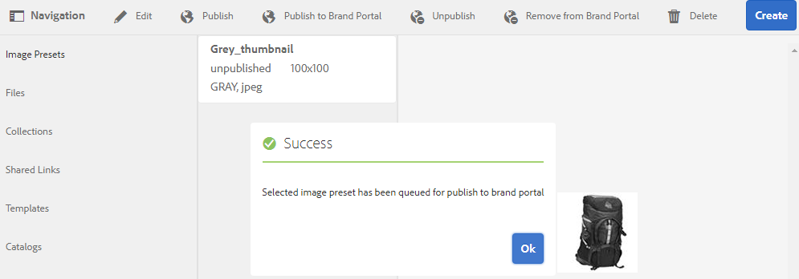
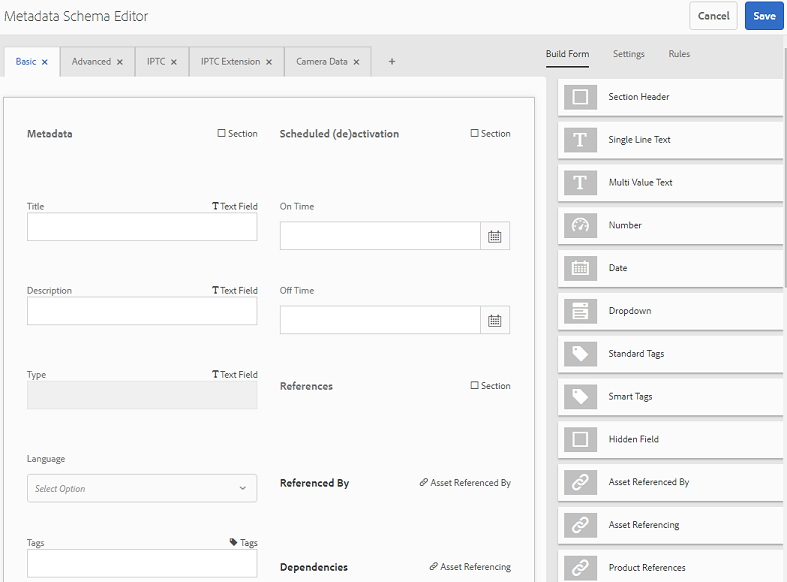
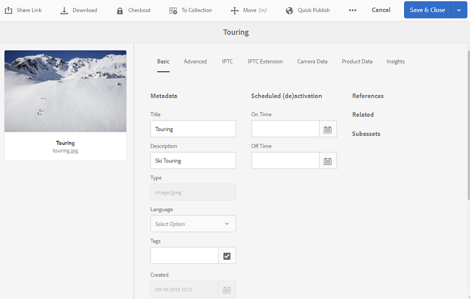
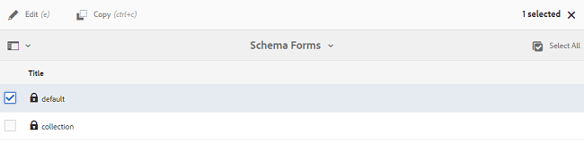
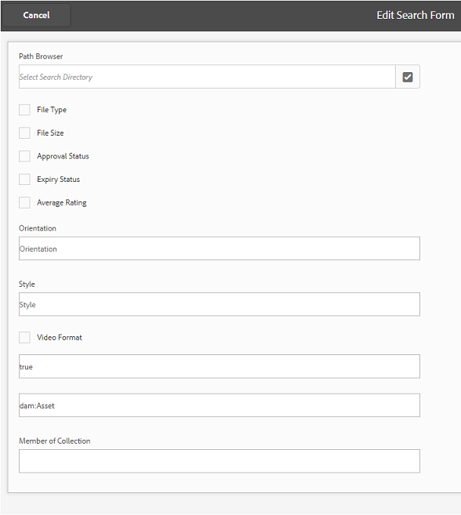
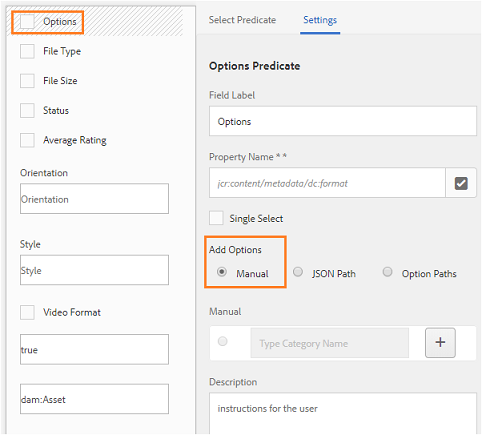

# Publicar predefinições, esquema e aspectos no Brand Portal {#publish-presets-schema-and-facets-to-brand-portal}

O artigo se aprofunda em predefinições de imagens de publicação, esquemas de metadados e aspectos de pesquisa personalizados da instância do autor de AEM para o Portal de marcas. O recurso de publicação permite que as organizações reutilizem predefinições de imagens, esquemas de metadados e aspectos de pesquisa criados/modificados na instância do autor de AEM, reduzindo assim os esforços duplicados.

>[!NOTE]
>
>A capacidade de publicar predefinições de imagens, esquema de metadados e aspectos de pesquisa da instância do autor de AEM para o Portal de marcas está disponível a partir de AEM 6.2 SP1-CFP7 e AEM 6.3 SP 1-CFP 1 (6.3.1.1).

## Publicar predefinições de imagens no Brand Portal {#publish-image-presets-to-brand-portal}

As predefinições de imagens são um conjunto de comandos de dimensionamento e formatação aplicados à imagem no momento da entrega da imagem. As predefinições de imagens podem ser criadas e modificadas no Brand Portal. Como alternativa, se a instância do autor de AEM estiver sendo executada no modo de mídia dinâmica, os usuários poderão criar predefinições no autor de AEM e publicá-las no portal de marcas de ativos de AEM e evitar a recriação das mesmas predefinições no Portal de marcas.\
Depois que a predefinição é criada, ela é listada como representação dinâmica no painel de representações detalhadas do ativo e na caixa de diálogo de download.

>[!NOTE]
>
>Se a instância do autor de AEM não estiver sendo executada no modo [!UICONTROL de mídia] dinâmica (o cliente não comprou a Mídia dinâmica), a execução TIFF [!UICONTROL da] pirâmide dos ativos não será criada no momento do upload. As predefinições de imagens ou representações dinâmicas funcionam em TIFF  pirâmide de um ativo. Portanto, se o TIFF  pirâmide não estiver disponível na instância do autor de AEM, ele também não estará disponível no Portal de marcas. Como resultado, nenhuma representação dinâmica está presente no painel de representações da página de detalhes do ativo e na caixa de diálogo de download.

Para publicar predefinições de imagens no Brand Portal:

1. Na instância do autor de AEM, toque/ clique no logotipo do AEM para acessar o console de navegação global e toque/ clique no ícone Ferramentas e navegue até **[!UICONTROL Ativos]** &gt; Predefinições **[!UICONTROL de]** imagem.
2. Selecione a predefinição de imagem ou várias predefinições de imagem na lista de predefinições de imagem e clique/toque em **[!UICONTROL Publicar no Portal]** de Marca.

>[!NOTE]
>
>Quando os usuários clicam em **[!UICONTROL Publicar no Brand Portal]** , as predefinições de imagem são enfileiradas para publicação. Os usuários devem monitorar o log dos agentes de replicação para confirmar se a publicação foi bem-sucedida.

Para cancelar a publicação de uma predefinição de imagem no Portal de marcas:

1. Na instância do autor de AEM, toque/ clique no logotipo do AEM para acessar o console de navegação global e toque/clique no ícone **[!UICONTROL Ferramentas]** e navegue até **[!UICONTROL Ativos &gt; Predefinições]** de imagem.
2. Selecione uma predefinição de imagem e selecione **[!UICONTROL Remover do Brand Portal]** nas opções disponíveis na parte superior.

## Publicar esquema de metadados no Brand Portal {#publish-metadata-schema-to-brand-portal}

O esquema de metadados descreve o layout e as propriedades que são exibidas na página de propriedades de ativo/coleções.

 

Se os usuários tiverem editado o esquema padrão na instância do autor de AEM e estiverem dispostos a usar o mesmo esquema como esquema padrão no Portal de Marcas, eles poderão simplesmente publicar os formulários de esquema de metadados no Portal de Marcas. Nesse cenário, o esquema padrão no Brand Portal é substituído pelos esquemas padrão publicados na instância do autor de AEM.

Se os usuários criarem um esquema personalizado na instância do autor de AEM, poderão publicar o esquema personalizado no Portal de marcas em vez de recriar o mesmo esquema personalizado. Os usuários podem aplicar esse esquema personalizado a qualquer pasta/coleção no Brand Portal.

>[!NOTE]
>
>Os esquemas padrão não podem ser publicados no Brand Portal se estiverem bloqueados na instância do AEM (ou seja, se não estiverem editados).

>[!NOTE]
>
>Se uma pasta tiver um esquema aplicado à instância do autor de AEM, o mesmo esquema também deverá existir no Portal de marcas para manter a consistência na página de propriedades do ativo no AEM Author and Brand Portal.

Para publicar um esquema de metadados da instância do autor de AEM no Portal de marcas:

1. Na instância do autor de AEM, toque/ clique no logotipo do AEM para acessar o console de navegação global e toque/clique no ícone Ferramentas e navegue até **[!UICONTROL Ativos &gt; Esquemas]** de metadados.
2. Selecione um esquema de metadados e selecione **[!UICONTROL Publicar no Brand Portal]** nas opções disponíveis na parte superior.

>[!NOTE]
>
>Quando os usuários clicam em **[!UICONTROL Publicar no Brand Portal]**, os esquemas de metadados são enfileirados para publicação. Os usuários devem monitorar o log dos agentes de replicação para confirmar se a publicação foi bem-sucedida.

Para cancelar a publicação de um esquema de metadados do Portal de marcas:

1. Na instância do autor de AEM, toque/ clique no logotipo do AEM para acessar o console de navegação global e toque/clique no ícone Ferramentas e navegue até **[!UICONTROL Ativos &gt; Esquemas]** de metadados.
2. Selecione um esquema de metadados e selecione **[!UICONTROL Remover do Brand Portal]** nas opções disponíveis na parte superior.

## Publicar aspectos de pesquisa no Brand Portal {#publish-search-facets-to-brand-portal}

Os formulários de pesquisa fornecem a capacidade de pesquisa  facetada para os usuários no Brand Portal. Os aspectos de pesquisa fornecem maior granularidade para pesquisas no Brand Portal. Todos os [predicados adicionados](https://helpx.adobe.com/experience-manager/6-5/assets/using/search-facets.html#AddingaPredicate) no formulário de pesquisa estão disponíveis para os usuários como aspectos de pesquisa nos filtros de pesquisa.

Se você estiver disposto a usar o formulário de pesquisa personalizado **[!UICONTROL Assets Admin Search Rail]** da instância do autor de AEM, em vez de recriar o mesmo formulário no Brand Portal, poderá publicar o formulário de pesquisa personalizado da instância do autor de AEM para o Brand Portal.

>[!NOTE]
>
>A pesquisa bloqueada no painel **[!UICONTROL Pesquisa do administrador de]** ativos nos ativos AEM não pode ser publicada no Portal da marca, a menos que seja editada. Depois de editado e publicado no Brand Portal, esse formulário de pesquisa substitui o formulário de pesquisa no Brand Portal.

Para publicar o aspecto de pesquisa editado da instância do autor de AEM no Portal de marcas:

1. Toque/clique no logotipo do AEM e vá até **[!UICONTROL Ferramentas]** &gt; **[!UICONTROL Geral]** &gt; **[!UICONTROL Pesquisar formulários]**.
2. Selecione o formulário de pesquisa editado e selecione **[!UICONTROL Publicar no Brand Portal]**.

   >[!NOTE]
   >
   >Quando os usuários clicam em **[!UICONTROL Publicar no Brand Portal]**, as facetas de pesquisa são enfileiradas para publicação. Os usuários devem monitorar o log dos agentes de replicação para confirmar se a publicação foi bem-sucedida.

Para cancelar a publicação de formulários de pesquisa no Portal de marcas:

1. Na instância do autor de AEM, toque/ clique no logotipo do AEM para acessar o console de navegação global e toque/clique no ícone Ferramentas e navegue até **[!UICONTROL Geral &gt; Pesquisar formulários]**.
2. Selecione o formulário de pesquisa e selecione **[!UICONTROL Remover do Brand Portal]** nas opções disponíveis na parte superior.

>[!NOTE]
>
>A ação **[!UICONTROL Cancelar publicação do Brand Portal]** deixa o formulário de pesquisa padrão no Brand Portal e não restaura para o último formulário de pesquisa usado antes da publicação.

### Limitações {#limitations}

1. Poucos predicados de pesquisa não se aplicam a filtros de pesquisa no Portal de marcas. Quando esses predicados de pesquisa são publicados como parte do formulário de pesquisa da instância do autor de AEM para o Portal de marcas, eles são filtrados. Os usuários, portanto, veem um número menor de predicados no formulário publicado no Brand Portal. Consulte predicados de [pesquisa aplicáveis a filtros no Brand Portal](../using/brand-portal-search-facets.md#list-of-search-predicates).

2. Para o Predicado [!UICONTROL de]opções, se um usuário estiver usando qualquer caminho personalizado para ler opções na instância do autor de AEM, ele não funcionará no Portal de marcas. Esses caminhos e opções adicionais não são publicados no Brand Portal com o formulário de pesquisa. Nesse caso, os usuários podem selecionar a opção **[!UICONTROL Manual]** em **[!UICONTROL Adicionar opções]** no Predicado **[!UICONTROL de]** opções para adicionar essas opções manualmente no Portal de marcas.

