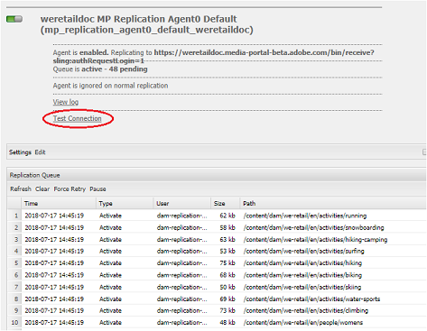

# Solucionar problemas na publicação paralela no Brand Portal {#troubleshoot-issues-in-parallel-publishing-to-brand-portal}

O Brand Portal está configurado com AEM Assets para que os ativos aprovados da marca sejam assimilados (ou publicados) sem problemas da instância do autor do AEM Assets. Depois de [configurado](../using/configure-aem-assets-with-brand-portal.md), o AEM Author usa um agente de replicação para replicar os ativos selecionados para o serviço em nuvem do Brand Portal para uso aprovado pelos usuários do Brand Portal. Vários agentes de replicação são usados no AEM 6.2 SP1-CFP5, AEM CFP 6.3.0.2 e versões posteriores para permitir a publicação paralela de alta velocidade.

>[!NOTE]
>
>A Adobe recomenda atualizar para o AEM 6.4.1.0 para garantir que o Portal de marcas do AEM Assets seja configurado com êxito com AEM Assets. Uma limitação no AEM 6.4 dá um erro ao configurar AEM Assets com o Brand Portal e a replicação falha.

Ao configurar o serviço em nuvem para o portal da marca em **[!UICONTROL /etc/cloudservice]**, todos os usuários e token necessários são gerados automaticamente e salvos no repositório. A configuração do serviço em nuvem é criada, os usuários de serviço necessários para que os agentes de replicação e replicação replicem o conteúdo também são criados. Isso cria quatro agentes de replicação. Assim, quando você publica vários ativos do AEM para o Brand Portal, eles são enfileirados e distribuídos entre esses agentes de replicação por meio da Round Robin.

No entanto, a publicação pode falhar intermitentemente devido a grandes tarefas de sling, aumento de E/S **[!UICONTROL de rede e]** disco na instância do AEM Author ou lentidão no desempenho da instância do AEM Author. Portanto, recomenda-se testar a conexão com os agentes de replicação antes de começar a publicação.

## Solucionar problemas de falhas na primeira publicação: validação da configuração de publicação {#troubleshoot-failures-in-first-time-publishing-validating-your-publish-configuration}

Para validar suas configurações de publicação:

1. Verifique os registros de erros
1. Verificar se o agente de replicação foi criado
1. Testar conexão

**Registros de e-mail ao criar o Cloud Service**

Verifique os registros de cauda. Verifique se o agente de replicação foi criado ou não. Se a criação do agente de replicação falhar, edite o serviço em nuvem fazendo pequenas alterações no serviço em nuvem. Valide e verifique novamente se o agente de replicação foi criado ou não. Caso contrário, edite novamente o serviço.

Se, ao editar repetidamente o serviço de nuvem, ele não estiver configurado corretamente, informe um tíquete de creche.

**Testar conexão com agentes de replicação**

Registro de Visualizações, se forem encontrados erros no registro de replicação:

1. Entre em contato com o suporte da Adobe.

1. Repita a [limpeza](../using/troubleshoot-parallel-publishing.md#clean-up-existing-config) e crie a configuração de publicação novamente.

<!--
Comment Type: remark
Last Modified By: Mini Gulati (mgulati)
Last Modified Date: 2018-06-21T22:56:21.256-0400

?? check and compare public key. At times public key is different

?? another thing to check in /useradmin

-->

### Limpar configurações de publicação existentes do Brand Portal {#clean-up-existing-config}

Na maioria das vezes em que a publicação não está funcionando, o motivo pode ser o usuário que está publicando (por exemplo: `mac-<tenantid>-replication` não tem a chave privada mais recente e, portanto, a publicação falha com o erro &quot;401 não autorizado&quot; e nenhum outro erro é relatado nos registros do agente de replicação. Você pode evitar a solução de problemas e criar uma nova configuração. Para que a nova configuração funcione corretamente, limpe o seguinte da configuração do autor do AEM:

1. Vá para `localhost:4502/crx/de/` (considerando que você está executando a instância do autor em localhost:4502:\
   i. delete `/etc/replication/agents.author/mp_replication`ii. delete 
`/etc/cloudservices/mediaportal/<config_name>`

1. Vá para localhost:4502/useradmin:\
   i. procurar usuário `mac-<tenantid>replication`ii. excluir este usuário

Agora o sistema está todo limpo. Agora você pode tentar criar uma nova configuração de serviço de nuvem e ainda usar o aplicativo JWT já existente em [https://legacy-oauth.cloud.adobe.io/](https://legacy-oauth.cloud.adobe.io/). Não é necessário criar um novo aplicativo, mas apenas a chave pública precisa ser atualizada da configuração da nuvem recém-criada.

## Problema de visibilidade do locatário do aplicativo JWT para conexão de desenvolvedor {#developer-connection-jwt-application-tenant-visibility-issue}

Se estiver em [https://legacy-oauth.cloud.adobe.io/](https://legacy-oauth.cloud.adobe.io/), todas as organizações (locatários) para as quais os usuários atuais possuem o administrador do sistema serão listadas. Se você não encontrar o nome da organização aqui ou não puder criar um aplicativo para um locatário necessário aqui, verifique se você tem direitos suficientes (administrador do sistema) para fazer isso.

Há um problema conhecido nessa interface de usuário que para qualquer locatário somente os 10 aplicativos principais estão visíveis. Ao criar o aplicativo, mantenha-se nessa página e marque o URL como favorito. Não é necessário ir para a página de listagem do aplicativo e encontrar o aplicativo que você criou. Você pode acessar este URL marcado diretamente e atualizar/excluir o aplicativo, sempre que necessário.

O aplicativo JWT pode não estar listado adequadamente. Portanto, é aconselhável anotar/marcar o URL ao criar o aplicativo JWT.

## A execução da configuração para de funcionar {#running-configuration-stops-working}

<!--
Comment Type: draft

If the running configuration stops working, either of the following two possibilities
<g class="gr_ gr_15 gr-alert gr_gramm gr_inline_cards gr_run_anim Grammar multiReplace" data-gr-id="15" id="15" style="font-size: 12px;">
are
</g> there:

1.
<g class="gr_ gr_14 gr-alert gr_gramm gr_inline_cards gr_run_anim Grammar only-ins doubleReplace replaceWithoutSep" data-gr-id="14" id="14">
Connection
</g> has failed, or

2. Publish has failed with permission to dam-replication-service denied, while connection has passed 

If the connection has failed [1], the
<g class="gr_ gr_10 gr-alert gr_spell gr_inline_cards gr_run_anim ContextualSpelling ins-del multiReplace" data-gr-id="10" id="10">
fail safe
</g> way to fix it is to <a href="../using/troubleshoot-parallel-publishing.md#main-pars-header-1664955658">clean up</a> the existing Brand Portal publish configuration and recreate a publish configuration. 

However, if the
<g class="gr_ gr_18 gr-alert gr_spell gr_inline_cards gr_run_anim ContextualSpelling" data-gr-id="18" id="18">
publish
</g> has failed with
<g class="gr_ gr_16 gr-alert gr_gramm gr_inline_cards gr_run_anim Grammar only-ins doubleReplace replaceWithoutSep" data-gr-id="16" id="16">
permission
</g> denied to dam-replication-service, raise a support ticket.

-->

Se um agente de replicação (que publicava no portal da marca apenas corretamente) interromper o processamento de trabalhos de publicação, verifique os registros de replicação. O AEM tem uma nova tentativa integrada automaticamente, portanto, se uma publicação de ativo específica falhar, ela será repetida automaticamente. Se houver algum problema intermitente como erro de rede, ele poderá ser bem-sucedido durante a nova tentativa.

Se houver falhas de publicação contínuas e a fila estiver bloqueada, verifique a conexão **[!UICONTROL de]** teste e tente resolver os erros que estão sendo reportados.

Com base nos erros, você é aconselhado a registrar um ticket de suporte para que a equipe de engenharia do Brand Portal possa ajudá-lo a resolver os problemas.

## Configurar agentes de replicação para evitar erro de tempo limite de conexão {#connection-timeout}

**Problema**: Não consigo publicar ativos do AEM Assets para o Brand Portal. O log de replicação indica que a conexão expirou.

**Resolução**: Normalmente, a publicação falha com um erro de tempo limite se houver várias solicitações pendentes na fila de replicação. Para resolver o problema, verifique se os agentes de replicação estão configurados para evitar o tempo limite.

Execute as seguintes etapas para configurar o agente de replicação:
1. Faça logon na instância do autor do AEM Assets.
1. No painel **Ferramentas** , navegue até **[!UICONTROL Implantação]** > **[!UICONTROL Replicação]**.
1. Na página Replicação, clique em **[!UICONTROL Agentes no autor]**. Você pode ver os quatro agentes de replicação do seu locatário do Brand Portal.
1. Clique no URL do agente de replicação para abrir os detalhes do agente.
1. Clique em **[!UICONTROL Editar]** para modificar as configurações do agente de replicação.
1. Em Configurações do agente, clique na guia **[!UICONTROL Estendido]** .
1. Ative a caixa de seleção **[!UICONTROL Fechar conexão]** .
1. Repita as etapas de 4 a 7 para configurar todos os quatro agentes de replicação.
1. Reinicie o servidor.