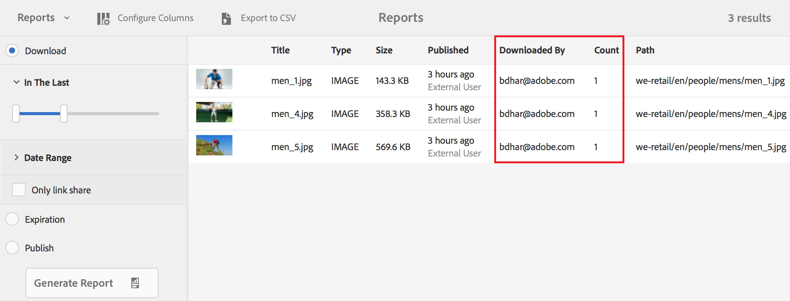

# Novidades do AEM Assets Brand Portal {#what-s-new-in-aem-assets-brand-portal}

O Portal de marcas de ativos Adobe Experience Manager (AEM) ajuda você a facilmente adquirir, controlar e distribuir com segurança ativos criativos aprovados para terceiros e usuários empresariais internos em todos os dispositivos. Ajuda a melhorar a eficiência do compartilhamento de ativos, acelera o tempo de comercialização dos ativos e reduz o risco de não conformidade e acesso não autorizado. O Adobe está trabalhando para melhorar a experiência geral do Brand Portal. Veja os novos recursos e melhorias.

## O que mudou em 2020.10.0 {#what-changed-in-oct-2020}

O Brand Portal 2020.10.0 é uma versão aprimorada que tem como objetivo simplificar a experiência de download de ativos e inclui correções essenciais. O aprimoramento inclui fluxo de trabalho novo e aprimorado para download de ativos, opções adicionais para excluir representações, download direto do painel **[!UICONTROL Representações]**, configuração para permitir direitos de acesso e download para grupos específicos de usuários e fácil navegação para arquivos, coleções e links compartilhados de todas as páginas do Portal de marcas. Consulte as últimas [Notas de versão do Brand Portal](brand-portal-release-notes.md).

### Experiência de download simplificada {#download-dialog}

Anteriormente, a caixa de diálogo **[!UICONTROL Download]** aparecia com várias opções, como criar uma pasta separada para cada ativo, ativo de email, selecionar ativo original, representações personalizadas, representações dinâmicas, excluir representações do sistema e ativar a aceleração de download, que eram ambíguas para usuários não técnicos ou novos, especialmente quando vários ativos ou pastas foram selecionados para download. Além disso, o usuário não pôde visualizar todas as representações de ativos ou excluir uma representação personalizada ou dinâmica específica.

A nova caixa de diálogo **[!UICONTROL Baixar]** generaliza o processo de seleção e filtragem de ativos, o que facilita que os usuários do Brand Portal tomem decisões eficazes ao baixar as execuções de ativos. Ele lista todos os ativos selecionados e suas representações, dependendo das configurações [**[!UICONTROL Download]**](brand-portal-download-assets.md) e **[!UICONTROL Download]**.

>[!NOTE]
>
>Todos os usuários agora terão **[!UICONTROL Download rápido]** ativado por padrão e requer [IBM Aspera Connect 3.9.9](https://www.ibm.com/support/knowledgecenter/SSXMX3_3.9.9/kc/connect_welcome.html) instalado na extensão de seu navegador antes de baixar os ativos do Brand Portal.

<!--
If any of the **[!UICONTROL Custom Rendition]** or **[!UICONTROL System Rendition]** is enabled in the [**[!UICONTROL Download]**](brand-portal-download-assets.md) configuration and **[!UICONTROL Download]** settings are enabled for the group users, the new **[!UICONTROL Download]** dialog appears with all the renditions of the selected assets or folders containing assets in a list view. 
-->

Na caixa de diálogo **[!UICONTROL Baixar]**, os usuários podem:

* Visualização todas as representações disponíveis de qualquer ativo na lista de download.
* Exclua representações dos ativos que não são necessárias para download.
* Aplique o mesmo conjunto de representações a todos os tipos de ativos semelhantes em um clique.
* Aplique um conjunto diferente de representações para diferentes tipos de ativos.
* Criar uma pasta separada para cada ativo.
* Baixe os ativos selecionados e suas representações.

O fluxo de trabalho de download permanece constante para ativos independentes, vários ativos, pastas que contêm ativos, ativos licenciados ou não licenciados e o download de ativos usando o link de compartilhamento. Consulte [etapas para baixar ativos do Brand Portal](https://docs.adobe.com/content/help/en/experience-manager-brand-portal/using/download/brand-portal-download-assets.html#download-assets).

### Navegação rápida {#quick-navigation}

Anteriormente, a opção de visualização de **[!UICONTROL Arquivos]**, **[!UICONTROL Coleções]** e **[!UICONTROL Links compartilhados]** ficava oculta e exigia vários cliques sempre que o usuário desejava alternar para outra visualização.

No Brand Portal 2020.10.0, os usuários podem navegar até **[!UICONTROL Arquivos]**, **[!UICONTROL Coleções]** e **[!UICONTROL Links compartilhados]** de todas as páginas do Brand Portal com um clique usando os links de navegação rápidos.

### Painel de representação aprimorado {#rendition-panel}

Anteriormente, os usuários só podiam visualização o ativo original e suas representações no painel **[!UICONTROL Representações]** se qualquer uma das **[!UICONTROL Representação personalizada]** ou **[!UICONTROL Representação do sistema]** estivesse ativada na configuração **[!UICONTROL Download]**. Além disso, os usuários tinham que baixar todas as representações de ativos, pois não havia filtro para excluir representações personalizadas ou dinâmicas específicas que não eram necessárias.

<!--
Earlier, if any of the custom or system renditions was enabled in the **[!UICONTROL Download]** settings, an additional **[!UICONTROL Download]** dialog appeared on clicking the **[!UICONTROL Download]** button wherein the user had to manually select the set of renditions (original asset, custom renditions, dynamic renditions) to download.
There was no filter to exclude specific custom or dynamic renditions which were not required for download.
-->

No Brand Portal 2020.10.0, os usuários podem excluir representações específicas e [baixar diretamente as representações selecionadas do painel Representações](brand-portal-download-assets.md#download-assets-from-asset-details-page) na página de detalhes do ativo sem precisar abrir a caixa de diálogo **[!UICONTROL Download]**.

<!-- 
In Brand Portal 2020.10.0, direct download and exclude renditions features are introduced in the **[!UICONTROL Renditions]** panel on the asset details page. All the renditions (original asset, custom renditions, dynamic renditions) under the rendition panel are now associated with a check box and are enabled by default. 

The user can clear the check boxes to exclude the renditions which are not required for download. And can click on the **[!UICONTROL Download]** button in the **[!UICONTROL Renditions]** panel to directly download the selected set of renditions in a zip folder without having to open the **[!UICONTROL Download]** dialog.
-->

### Configurar permissões de download {#download-permissions}

Além das configurações existentes **[!UICONTROL Download]**, os administradores do Brand Portal também podem configurar permissões para que diferentes grupos de usuários façam visualização e (ou) baixem o ativo original e suas representações da página de detalhes do ativo.

Faça logon no locatário do Brand Portal como administrador e navegue até **[!UICONTROL Ferramentas]** > **[!UICONTROL Usuários]**.

Na página **[!UICONTROL Funções do usuário]**, navegue até a guia **[!UICONTROL Grupos]** para configurar as permissões de visualização e (ou) download para os grupos de usuários

Anteriormente, as configurações estavam disponíveis somente para impedir que os usuários do grupo baixassem o ativo original.

A guia **[!UICONTROL Grupos]** na página **[!UICONTROL Funções do Usuário]** permite que os administradores definam as configurações de visualização e download:

* Se as configurações **[!UICONTROL Baixar original]** e **[!UICONTROL Baixar representações]** estiverem ativadas, os usuários do grupo selecionado poderão fazer visualização e baixar os ativos originais e suas representações.
* Se ambas as configurações estiverem desativadas, os usuários poderão apenas visualização os ativos originais. As representações de ativos não estão visíveis para os usuários na página de detalhes do ativo.
* Se apenas a configuração **[!UICONTROL Baixar original]** estiver ativada, os usuários poderão visualização e baixar somente os ativos originais da página de detalhes do ativo.
* Se apenas a configuração **[!UICONTROL Baixar representações]** estiver ativada, os usuários poderão visualização o ativo original, mas não poderão baixá-lo. No entanto, o usuário pode visualização e baixar as representações do ativo.

Consulte [configurar o download de ativos](https://docs.adobe.com/content/help/en/experience-manager-brand-portal/using/download/brand-portal-download-assets.html#configure-download-permissions).

>[!NOTE]
>
>Se um usuário for adicionado a vários grupos e um deles tiver restrições, as restrições serão aplicadas ao usuário.

<!--
>Restrictions to access the original asset and their renditions do not apply to administrators even if they are members of restricted groups.
 >
 >The users can always download assets and their renditions from the repository using a `curl` request even if the download configurations are turned-off.
 >
-->

## O que mudou na versão 6.4.7 {#what-changed-in-647}

A versão 6.4.7 do Brand Portal traz o Visualizador de Documentos, aprimora a experiência de download de ativos e inclui correções críticas. Consulte as últimas [Notas de versão do Brand Portal](brand-portal-release-notes.md).

<!--
Brand Portal 6.4.7 release brings in the Document Viewer, leverages the Brand Portal administrators to configure asset download, and centers top customer requests. See latest [Brand Portal Release Notes](brand-portal-release-notes.md).
-->

### Visualizador de documentos {#doc-viewer}

O Visualizador de Documentos aprimora a experiência de visualização de PDF. Ele fornece uma experiência semelhante à do Adobe Document Cloud enquanto exibe os arquivos PDF no Brand Portal.

Anteriormente, as opções limitadas estavam disponíveis para visualização dos arquivos PDF.

Com o Visualizador de Documentos, os usuários do Portal de marcas agora têm as opções para visualização de páginas, marcadores de visualização, pesquisa de texto na página, ampliar, diminuir o zoom, navegar para as páginas anteriores e seguintes, alternar para a página, ajustar à janela, ajustar à tela e ocultar ou ocultar a barra de ferramentas.

>[!NOTE]
>
>A experiência de exibição para outros formatos de documentos permanece inalterada.

### Baixar a experiência {#download-configurations}

O processo de download de ativos é remodelado, proporcionando uma experiência simplificada para o usuário ao [baixar ativos do Brand Portal](brand-portal-download-assets.md).

O fluxo de trabalho existente de download de ativos do Brand Portal é inevitavelmente seguido pela aparência de uma caixa de diálogo **[!UICONTROL Download]** com várias opções de download a serem escolhidas.

No Brand Portal 6.4.7, os administradores do Brand Portal podem definir as configurações **[!UICONTROL Download]** do ativo. As configurações disponíveis são:
* **[!UICONTROL Download rápido]**
* **[!UICONTROL Representações personalizadas]**
* **[!UICONTROL Representações do sistema]**

O administrador do Brand Portal pode habilitar qualquer combinação para configurar o download de ativos.

<!--In Brand Portal 6.4.7, fast download, custom renditions, and system renditions are the three configurations available.-->

* Se as configurações **[!UICONTROL Representações personalizadas]** e **[!UICONTROL Representações do sistema]** estiverem desativadas, as representações originais dos ativos serão baixadas sem qualquer diálogo adicional que simplifica a experiência de download dos usuários do Brand Portal.

* Se qualquer uma das **[!UICONTROL Representação personalizada]** ou **[!UICONTROL Representação do sistema]** estiver ativada, a caixa de diálogo **[!UICONTROL Download]** será exibida e o ativo original, juntamente com as representações do ativo, será baixado. Habilitar **[!UICONTROL Download rápido]** acelera o processo de download.

Com base na configuração, o fluxo de trabalho de download permanece constante para ativos independentes, vários ativos, pastas que contêm ativos, ativos licenciados ou não licenciados e o download de ativos usando o link de compartilhamento.

## O que mudou em 6.4.6 {#what-changed-in-646}

No Brand Portal 6.4.6, o canal de autorização entre o AEM Assets e o Brand Portal é alterado. O Brand Portal agora é compatível com o AEM Assets como Cloud Service, AEM Assets 6.3 e superior. No AEM Assets 6.3 e superior, o Brand Portal foi configurado anteriormente na interface clássica por meio do gateway OAuth herdado, que usa a troca de token JWT para obter um Token de acesso IMS para autorização. A AEM Assets agora está configurada com o Brand Portal por meio do Adobe Developer Console, que obtém um token IMS para autorização do locatário do Brand Portal.

<!-- The steps to configure integration are different depending on your AEM version, and whether you are configuring for the first-time, or upgrading the existing integration:
-->

<!--
  
   | **AEM Version** |**New Integration** |**Upgrade Integration** |
|---|---|---|
| **AEM 6.5** |[Create new integration](../using/brand-portal-configure-integration-65.md) |[Upgrade existing integration](../using/brand-portal-configure-integration-65.md#upgrade-integration-65) | 
| **AEM 6.4** |[Create new integration](../using/brand-portal-configure-integration-64.md) |[Upgrade existing integration](../using/brand-portal-configure-integration-64.md#upgrade-integration-64) | 
| **AEM 6.3** |[Create new integration](../using/brand-portal-configure-integration-63.md) |[Upgrade existing integration](../using/brand-portal-configure-integration-63.md#upgrade-integration-63) | 
| **AEM 6.2** |Contact Support |Contact Support | 

   -->

As etapas para configurar o AEM Assets com o Brand Portal são diferentes dependendo da versão AEM e se você está configurando pela primeira vez ou atualizando as configurações existentes:

<!--| **AEM Version** |**New Configuration** |**Upgrade Configuration** |
|---|---|---|
| **AEM 6.5 (6.5.4.0 and above)** |[Create configuration](../using/brand-portal-configure-integration-65.md) |[Upgrade configuration](../using/brand-portal-configure-integration-65.md#upgrade-integration-65) | 
| **AEM 6.4 (6.4.8.0 and above)** |[Create configuration](../using/brand-portal-configure-integration-64.md) |[Upgrade configuration](../using/brand-portal-configure-integration-64.md#upgrade-integration-64) | 
| **AEM 6.3 (6.3.3.8 and above)** |[Create configuration](../using/brand-portal-configure-integration-63.md) |[Upgrade configuration](../using/brand-portal-configure-integration-63.md#upgrade-integration-63) | 
| **AEM 6.2** |Contact Support |Contact Support | 
-->

<!-- AEM Assets configuration with Brand Portal on Adobe I/O is supported on:
* AEM 6.5.4.0 and above
* AEM 6.4.8.0 and above
* AEM 6.3.3.8 and above -->

| **Versão do AEM** | **Nova configuração** | **Configuração de atualização** |
|---|---|---|
| **AEM Assets as a Cloud Service** | [Criar configuração](https://docs.adobe.com/content/help/en/experience-manager-cloud-service/assets/brand-portal/configure-aem-assets-with-brand-portal.html) | - |
| **AEM 6.5 (6.5.4.0 e superior)** | [Criar configuração](https://docs.adobe.com/content/help/en/experience-manager-65/assets/brandportal/configure-aem-assets-with-brand-portal.html) | [Atualizar configuração](https://docs.adobe.com/content/help/en/experience-manager-65/assets/brandportal/configure-aem-assets-with-brand-portal.html#upgrade-integration-65) |
| **AEM 6.4 (6.4.8.0 e superior)** | [Criar configuração](https://docs.adobe.com/content/help/en/experience-manager-64/assets/brandportal/configure-aem-assets-with-brand-portal.html) | [Atualizar configuração](https://docs.adobe.com/content/help/en/experience-manager-64/assets/brandportal/configure-aem-assets-with-brand-portal.html#upgrade-integration-64) |
| **AEM 6.3 (6.3.3.8 e superior)** | [Criar configuração](https://helpx.adobe.com/experience-manager/6-3/assets/using/brand-portal-configuring-integration.html) | [Atualizar configuração](https://helpx.adobe.com/experience-manager/6-3/assets/using/brand-portal-configuring-integration.html#Upgradeconfiguration) |
| **AEM 6.2** | Entre em contato com o suporte | Entre em contato com o suporte |

>[!NOTE]
>
>É recomendável atualizar sua instância AEM para o service pack mais recente.

Consulte as últimas [Notas de versão do Brand Portal](brand-portal-release-notes.md).

Consulte [Perguntas frequentes do Brand Portal](brand-portal-faqs.md).

## O que mudou na versão 6.4.5 {#what-changed-in-645}

O Brand Portal 6.4.5 é uma versão do recurso que tem como objetivo fornecer aos usuários do Brand Portal (agências/equipes externas) a capacidade de carregar conteúdo no Brand Portal e publicá-lo nos AEM Assets, sem precisar acessar o ambiente de criação. Este recurso é chamado **[Origem de ativos no Brand Portal](brand-portal-asset-sourcing.md)** e melhorará as experiências do cliente, fornecendo um mecanismo bidirecional para que os usuários contribuam e compartilhem ativos com outros usuários do Brand Portal distribuídos globalmente.

### Origem de ativos no Brand Portal {#asset-sourcing-in-bp}

A Origem de ativos permite que usuários AEM (administradores/não administradores) criem novas pastas com uma propriedade adicional **Contribuição de ativos**, garantindo que a nova pasta criada seja aberta para envio de ativos por usuários do Brand Portal. Isso aciona automaticamente um fluxo de trabalho que cria duas subpastas adicionais, chamadas NEW e SHARED, na pasta recém-criada **Contribution**.

O usuário do AEM define o requisito ao [fazer upload de um resumo](brand-portal-configure-contribution-folder-properties.md) sobre os tipos de ativos que devem ser adicionados à pasta de contribuição, bem como ao [fazer upload dos ativos da linha de base](brand-portal-upload-baseline-assets.md), na pasta **SHARED** para garantir que os usuários do BP tenham as informações de referência necessárias. O administrador pode conceder aos usuários ativos do Brand Portal acesso à pasta de contribuição antes de publicar a pasta recém-criada **Contribution** no Brand Portal.

Quando o usuário terminar de adicionar conteúdo na pasta **NEW**, poderá publicar a pasta de contribuição de volta no ambiente do autor AEM. Observe que pode levar alguns minutos para concluir a importação e refletir o conteúdo recém-publicado no AEM Assets.

Além disso, toda a funcionalidade existente permanece inalterada. Os usuários do Brand Portal podem visualização, pesquisar e baixar ativos da pasta de contribuição, bem como de outras pastas permitidas. E os administradores podem compartilhar ainda mais a pasta de contribuição, modificar as propriedades e adicionar ativos às coleções.

>[!NOTE]
>
>A Seleção de recursos no Brand Portal é compatível com AEM 6.5.2.0 e superior.
>
>O recurso não é suportado nas versões anteriores - AEM 6.3 e AEM 6.4.

### Carregar ativos para a pasta de contribuição {#upload-assets-in-bp}

Os usuários do Brand Portal com as permissões apropriadas podem [baixar os requisitos de ativos](brand-portal-download-asset-requirements.md) para entender a necessidade de contribuição e fazer upload de vários ativos ou pastas que contêm vários ativos para a pasta de contribuição. Entretanto, observe que os usuários do Brand Portal só podem carregar ativos na subpasta **NEW**. A pasta **SHARED** destina-se à distribuição de requisitos e ativos de linha de base. Consulte, [Carregar ativos para a pasta de contribuição](brand-portal-upload-assets-to-contribution-folder.md)

### Publicar pasta de contribuição no AEM Assets {#publish-assets-to-aem}

Quando o upload for concluído para a pasta **NEW**, os usuários do Brand Portal poderão publicar a pasta de contribuição de volta para AEM. Pode levar alguns minutos para importar e refletir o conteúdo/ativos publicados no AEM Assets. Consulte, [Publicar pasta de contribuição para o AEM Assets](brand-portal-publish-contribution-folder-to-aem-assets.md)

## O que mudou em 6.4.4 {#what-changed-in-644}

A versão 6.4.4 do Brand Portal foca em melhorias na pesquisa de texto e nas principais solicitações do cliente. Consulte as últimas [Notas de versão do Brand Portal](brand-portal-release-notes.md).

### Aprimoramentos de pesquisa

O Brand Portal 6.4.4 em diante oferece suporte à pesquisa de texto parcial no predicado de propriedade no painel de filtragem. Para permitir a pesquisa de texto parcial, é necessário ativar **Pesquisa parcial** no Predicado de propriedade no formulário de pesquisa.

Leia para saber mais sobre pesquisa de texto parcial e pesquisa de curinga.

#### Pesquisa de frase parcial {#partial-phrase-search}

Agora você pode pesquisar ativos especificando apenas uma parte (ou seja, uma palavra ou duas) da frase pesquisada no painel de filtragem.

**Use**
caseA pesquisa parcial de frases é útil quando você não tem certeza da combinação exata de palavras que ocorrem na frase pesquisada.

Por exemplo, se o formulário de pesquisa no Brand Portal usar o Predicado de propriedade para pesquisa parcial no título dos ativos, a especificação do termo **camp** retornará todos os ativos com o campo de palavras em suas frases de título.

#### Pesquisa curinga {#wildcard-search}

O Brand Portal permite o uso do asterisco (*) no query de pesquisa junto com uma parte da palavra na frase pesquisada.

**Caso**
de usoSe você não tiver certeza das palavras exatas que ocorrem na frase pesquisada, poderá usar uma pesquisa curinga para preencher as lacunas no query de pesquisa.

Por exemplo, especificar **climb*** retorna todos os ativos com palavras que começam com os caracteres **climb** em sua frase de título se o formulário de pesquisa no Brand Portal usar o Predicado de propriedade para pesquisa parcial sobre o título dos ativos.

Da mesma forma, especificando:

* ***** Inicia todos os ativos com palavras terminadas com personagens  **** escalando suas frases de título.

* ***climb*** retorna todos os ativos com palavras que incluem os caracteres que  **** sobem suas frases de título.

>[!NOTE]
>
>Ao marcar a caixa de seleção **Pesquisa parcial**, **Ignorar caso** é selecionado por padrão.

## O que mudou em 6.4.3 {#what-changed-in}

A versão 6.4.3 do Brand Portal foca em — fornecer às organizações um alias alternativo além da ID do locatário no URL de acesso do Brand Portal, nova configuração de hierarquia de pastas, aprimoramentos de suporte de vídeo, publicação agendada da instância do autor de AEM para o Brand Portal, melhorias operacionais — e atende às solicitações do cliente.

### Navegação de hierarquia de pastas para não administradores

Agora, os administradores podem configurar como as pastas são exibidas para usuários não administradores (editores, visualizadores e usuários convidados) no logon. [Ativar ](../using/brand-portal-general-configuration.md) hierarquia de pastas A configuração é adicionada em Configurações **** gerais, no painel Ferramentas administrativas. Se a configuração for:

* **ativada**, a árvore de pastas que começa na pasta raiz está visível para usuários não administradores. Assim, concedendo a eles uma experiência de navegação semelhante aos administradores.
* **desativado**, somente as pastas compartilhadas são exibidas na landing page.

A funcionalidade [Ativar hierarquia de pastas](../using/brand-portal-general-configuration.md) (quando ativada) ajuda a diferenciar as pastas com os mesmos nomes compartilhados de hierarquias diferentes. Ao fazer logon, usuários não administradores agora veem as pastas pai virtual (e ancestral) das pastas compartilhadas.

As pastas compartilhadas são organizadas nos respectivos diretórios em pastas virtuais. É possível reconhecer essas pastas virtuais com um ícone de cadeado.

Observe que a miniatura padrão das pastas virtuais é a imagem em miniatura da primeira pasta compartilhada.

### Pesquisar em hierarquia ou caminho de pasta específicos

**O predicado** Navegador de caminhos é introduzido no Formulário de pesquisa para permitir a pesquisa de ativos em um diretório específico. O caminho de pesquisa padrão do predicado de pesquisa para o Navegador de caminhos é `/content/dam/mac/<tenant-id>/`, que pode ser configurado editando o formulário de pesquisa padrão.

* Os usuários administradores podem usar o Navegador de caminhos para navegar até qualquer diretório de pastas no Brand Portal.
* Usuários não administradores podem usar o Navegador de caminhos para navegar somente para as pastas (e navegar de volta para as pastas pai) compartilhadas com eles.

   Por exemplo, `/content/dam/mac/<tenant-id>/folderA/folderB/folderC` é compartilhado com um usuário não administrador. O usuário pode pesquisar ativos na pastaC usando o Navegador de caminhos. Esse usuário também pode navegar para folderB e folderA (já que eles são ancestrais da folderC que é compartilhada com o usuário).

Agora você pode restringir a pesquisa de ativos em uma pasta específica que você navegou, em vez de começar na pasta raiz.

Observe que a pesquisa nessas pastas retorna os resultados somente dos ativos que foram compartilhados com o usuário.

### Suporte para execuções de vídeo do Dynamic Media

Os usuários cuja instância de autor de AEM esteja no modo híbrido Dynamic Media podem pré-visualização e baixar as execuções de mídia dinâmica, além dos arquivos de vídeo originais.

Para permitir a pré-visualização e o download de execuções de mídia dinâmica em contas de locatário específicas, os administradores precisam especificar **Configuração de Dynamic Media** (URL do serviço de vídeo (URL do Gateway DM) e ID de registro para buscar o vídeo dinâmico) na configuração **Vídeo** do painel de ferramentas administrativas.

Os vídeos do Dynamic Media podem ser visualizados em:

* Página de detalhes do ativo
* Visualização do cartão do ativo
* Página pré-visualização de compartilhamento de links

As codificações de Vídeo do Dynamic Media podem ser baixadas de:

* Brand Portal
* Link compartilhado

### Publicação agendada para o Brand Portal

O fluxo de trabalho de publicação de ativos (e pastas) de [AEM (6.4.2.0)](https://helpx.adobe.com/experience-manager/6-4/release-notes/sp-release-notes.html#main-pars_header_9658011) instância do autor para o Brand Portal pode ser agendado para uma data e hora posteriores.

Da mesma forma, os recursos publicados podem ser removidos do portal em uma data posterior (hora), agendando o fluxo de trabalho Cancelar publicação do Brand Portal.

### Alias de locatário configurável no URL

As organizações podem personalizar o URL do portal, tendo um prefixo alternativo no URL. Para obter um alias para o nome do locatário em seu URL de portal existente, as organizações precisam entrar em contato com o suporte ao Adobe.

Observe que somente o prefixo do URL do Portal de Marcas pode ser personalizado e não o URL inteiro.\
Por exemplo, uma organização com o domínio existente **geomettrix.brand-portal.adobe.com** pode obter **geomettrixinc.brand-portal.adobe.com** criados mediante solicitação.

No entanto, a instância do autor de AEM pode ser [configurada](https://helpx.adobe.com/experience-manager/6-5/assets/using/brand-portal-configuring-integration.html) somente com o URL de ID do locatário e não com o URL de alias do locatário (alternativo).

As organizações podem atender às suas necessidades de marca ao personalizar o URL do portal, em vez de se manterem no URL fornecido pelo Adobe.

### Melhorias na experiência de download

A versão do oferta simplificou a experiência de download com um número reduzido de cliques e avisos, em:

* Optar por baixar somente as representações (e não os ativos originais).
* Baixar os ativos quando o acesso às representações originais estiver restrito.

## O que mudou na versão 6.4.2 {#what-changed-in-1}

A versão do Brand Portal 6.4.2 traz uma variedade de recursos para atender às necessidades de distribuição de ativos das organizações e ajudá-las a atingir um grande número de usuários distribuídos globalmente por meio do acesso de convidado e da experiência ideal com downloads acelerados. O Brand Portal também oferece maior controle às organizações por meio de novas configurações para administradores, relatórios recém-adicionados e atende às solicitações dos clientes.

### Acesso de convidado

O portal de marcas AEM permite que os convidados acessem o portal. Um usuário convidado não precisa de credenciais para entrar no portal e pode acessar e baixar todas as pastas públicas e coleções. Os usuários convidados podem adicionar ativos a seus lightbox (coleção privada) e baixar os mesmos. Eles também podem visualização previsões de pesquisa e pesquisa de tags inteligentes definidas pelos administradores. A sessão de convidado não permite que os usuários criem coleções e pesquisas salvas ou as compartilhem ainda mais, acessem configurações de pastas e coleções e compartilhem ativos como links.

Em uma organização, várias sessões de convidado simultâneas são permitidas, o que é limitado a 10% da cota total de usuários por organização.

Uma sessão de convidado permanece ativa por duas horas. Portanto, o estado do lightbox também é preservado até duas horas a partir da hora do start da sessão. Depois de duas horas, a sessão de convidado tem que ser reiniciada, de modo que o estado do lightbox seja perdido.

### Downloads acelerados

Os usuários do Brand Portal podem aproveitar os downloads rápidos baseados no IBM Aspera Connect para obter velocidades 25 vezes mais rápidas e desfrutar de uma experiência contínua de download, independentemente de sua localização no mundo inteiro. Para baixar os recursos mais rapidamente do Brand Portal ou do link compartilhado, os usuários precisam selecionar a opção **Ativar aceleração de download** na caixa de diálogo de download, desde que a aceleração de download esteja ativada em sua organização.

Para habilitar o download acelerado com base no IBM Aspera para a organização, os administradores **Ativar a aceleração de download** (que está desabilitada por padrão) de [Configurações gerais](brand-portal-general-configuration.md#allow-download-acceleration) no painel de ferramentas administrativas. Para saber mais sobre pré-requisitos e etapas de solução de problemas para baixar arquivos de ativos mais rapidamente do Brand Portal e links compartilhados, consulte [Guia para acelerar os downloads do Brand Portal](../using/accelerated-download.md#main-pars-header).

### Relatório de logons de usuário

Um novo relatório, para rastrear os logons de usuário, foi introduzido. O relatório **Logons de usuário** pode ser fundamental para permitir que as organizações auditem e mantenham uma verificação sobre os administradores delegados e outros usuários do Brand Portal.

Os registros do relatório exibem nomes, IDs de e-mail, personas (administrador, visualizador, editor, convidado), grupos, último logon, status de atividade e contagem de logon de cada usuário da implantação do Brand Portal 6.4.2 até o momento da geração do relatório. Os administradores podem exportar o relatório como .csv. Juntamente com outros relatórios, o relatório Logons de usuário permite que as organizações monitorem mais detalhadamente as interações dos usuários com os recursos aprovados da marca, garantindo assim a conformidade com os escritórios de conformidade corporativos.

### Acesso a representações originais

Os administradores podem restringir o acesso do usuário aos arquivos de imagem originais (.jpeg, .tiff, .png, .bmp, .gif, .pjpeg, x-portable-anymap, x-portable-bitmap, x-portable-graymap, x-portable-pixmap, x-rgb, x-xbitmap, x-xpixmap, x-icon, imagem/photoshop, imagem/x-photoshop, psd, image/vnd.adobe.photoshop) e dá acesso a renderizações de baixa resolução que eles baixam do Brand Portal ou do link compartilhado. Esse acesso pode ser controlado no nível do grupo de usuários na guia Grupos da página Funções do usuário no painel Ferramentas administrativas.

* Por padrão, todos os usuários podem baixar representações originais, já que o Acesso ao original está ativado para todos.
* Os administradores precisam desmarcar as respectivas caixas de seleção para impedir que um grupo de usuários acesse execuções originais.
* Se um usuário for membro de vários grupos, mas apenas um deles tiver restrições, as restrições se aplicam a esse usuário.
* As restrições não se aplicam aos administradores, mesmo sendo membros de grupos restritos.
* As permissões dos usuários que compartilham ativos como link se aplicam aos usuários que baixam ativos usando links compartilhados.

### Caminho da hierarquia de pastas em visualizações de cartão e Lista

Os cartões de pastas, na Visualização de cartão, agora exibem informações de hierarquia de pastas para usuários não administradores (Editor, Visualizador e Usuário convidado). Essa funcionalidade permite que os usuários saibam o local das pastas que estão acessando, em relação à hierarquia pai.

As informações de hierarquia de pastas são particularmente úteis na diferenciação de pastas com nomes semelhantes a outras pastas compartilhadas de uma hierarquia de pastas diferente. Se os usuários não administradores não estiverem cientes da estrutura de pastas dos ativos compartilhados com eles, ativos/pastas com nomes semelhantes parecerão confusos.

* Os caminhos mostrados nos respectivos cartões são truncados para se ajustarem aos tamanhos dos cartões. No entanto, os usuários podem ver o caminho completo como uma dica de ferramenta ao passar o mouse sobre o caminho truncado.

A Visualização de lista mostra a pasta Caminho dos ativos em uma coluna para todos os usuários do Brand Portal.

### Opção Visão geral para visualização propriedades de ativos

O Brand Portal fornece a opção Visão geral para usuários não administradores (editores, visualizadores, usuários convidados) para visualização das Propriedades do ativo de ativos/pastas selecionados. A opção Visão geral está visível:

1. Na barra de ferramentas na parte superior da seleção de um ativo/pasta.
2. Na lista suspensa ao selecionar o Seletor de painel.

Ao selecionar a opção Visão geral enquanto um ativo/pasta é selecionado, os usuários podem ver o título, o caminho e a hora da criação do ativo. Enquanto isso, na página de detalhes do ativo, selecionar a opção Visão geral permite que os usuários vejam metadados do ativo.

## Novas configurações

Seis novas configurações são adicionadas aos administradores para ativar/desativar as seguintes funcionalidades em locatários específicos:

* Permitir acesso de convidado
* Permitir que os usuários solicitem acesso ao Brand Portal
* Permitir que os administradores excluam ativos do Brand Portal
* Permitir criação de coleções públicas
* Permitir a criação de coleções inteligentes públicas
* Permitir aceleração de download

As configurações acima estão disponíveis em Configurações gerais e de acesso no painel Ferramentas administrativas.

### Adobe I/O UI para configurar integrações do oAuth

A partir do Brand Portal 6.4.2, a interface Adobe.io [https://legacy-oauth.cloud.adobe.io/](https://legacy-oauth.cloud.adobe.io/) para criar o aplicativo JWT, que permite a configuração de integrações do oAuth para permitir a integração do AEM Assets com o Brand Portal. Anteriormente, a interface do usuário para configurar integrações OAuth era hospedada em `https://marketing.adobe.com/developer/`. Para saber mais sobre a integração do AEM Assets com o Brand Portal para a publicação de ativos e coleções no Brand Portal, consulte [Configurar a integração do AEM Assets com o Brand Portal](https://docs.adobe.com/content/help/en/experience-manager-64/assets/brandportal/configure-aem-assets-with-brand-portal.html).

## Aprimoramentos de pesquisa

Os administradores podem tornar os predicados de propriedade não sensíveis a maiúsculas e minúsculas usando o predicado de propriedade atualizado, que tem uma verificação para Ignorar maiúsculas e minúsculas. Essa opção está disponível para predicado de propriedade e predicado de propriedade de vários valores.\
No entanto, a pesquisa que não diferencia maiúsculas de minúsculas é comparativamente mais lenta do que a pesquisa padrão por predicado de propriedade. Se houver muitos predicados que não diferenciam maiúsculas de minúsculas no filtro de pesquisa, a pesquisa poderá diminuir. É, portanto, aconselhável utilizar judiciosamente a pesquisa que não faz distinção entre maiúsculas e minúsculas.

## O que mudou na versão 6.4.1 {#what-changed-in-2}

O Brand Portal 6.4.1 é uma versão de atualização da plataforma que traz vários novos recursos e aprimoramentos vitais, como navegação, pesquisa e aprimoramentos de desempenho para oferecer experiências satisfatórias aos clientes.

### Aprimoramentos de navegação

* Novo painel Árvore de conteúdo para navegar rapidamente em uma hierarquia de ativos.

* Introduzidos novos atalhos de teclado, por exemplo _(p)_ para navegação na página de propriedades, _(e)_ para Editar e _(ctrl+c)_ para operações de cópia.
* Experiência de rolagem aprimorada e carregamento lento em cartão e visualização de lista para navegação em um grande número de ativos.
* Visualização de placa aprimorada com suporte para placas de tamanho diferente com base na configuração de visualização.

* A visualização de cartão agora exibe o carimbo de data/hora ao passar o mouse sobre a etiqueta de data.

* Visualização aprimorada de Coluna com **Mais detalhes** no instantâneo de ativo, que permite navegar até a página de detalhes de um ativo.

* A visualização de lista agora exibe nomes de arquivos de ativos na primeira coluna por padrão, além de informações sobre localidade, tipo de ativo, dimensões, tamanho, classificação e publicação. As novas **Configurações de Visualização** podem ser usadas para configurar a quantidade de detalhes a serem exibidos na visualização de Lista.

* Experiência de detalhes de ativos aprimorada com a capacidade de navegar para frente e para trás entre ativos usando novos botões de navegação e contagem de ativos de visualização.

* Novo recurso para pré-visualização de arquivos de áudio, carregados do AEM, na página de detalhes do ativo.
* Recurso Novos ativos relacionados fornecido nas propriedades do ativo. Os ativos relacionados a outros ativos de origem/derivados no AEM e publicados no Brand Portal agora têm sua relação intacta no Brand Portal, com links para os ativos relacionados na página de propriedades.
* Uma nova configuração para impedir que usuários não administradores criem coleções públicas foi introduzida. As organizações podem trabalhar com a equipe de suporte do Adobe para configurar esse recurso em contas específicas.

### Aprimoramentos de pesquisa

* Recurso introduzido para voltar à mesma posição nos resultados da pesquisa, após navegar até um item de pesquisa, sem executar o query de pesquisa novamente.
* Nova contagem de resultados da pesquisa para exibir o número de resultados da pesquisa fornecidos.
* Filtro de pesquisa de tipo de arquivo aprimorado com a capacidade de filtrar resultados de pesquisa com base em tipos MIME refinados, como .jpg, .png e .psd, em comparação a imagens, Documentos e multimídia anteriores.
* Filtros de pesquisa aprimorados para coleções, com carimbos de data e hora precisos em vez da funcionalidade do controle deslizante de hora anterior.
* Novos filtros de tipo de acesso foram introduzidos para procurar as coleções que são públicas ou não.

### Otimizações de download

* Um único arquivo grande é baixado diretamente, sem a criação do arquivo zip, melhorando assim a velocidade e a throughput.
* O limite de download do Zip para o recurso de compartilhamento de links aumentou de 1 GB para 5 GB.

* Agora, os usuários podem optar por baixar apenas os arquivos personalizados e originais e impedir execuções prontas, enquanto baixam ativos do Brand Portal ou por meio do recurso de links compartilhados.

### Aprimoramentos de desempenho

* Melhoria de até 100% na velocidade de download dos ativos.
* Melhoria de até 40% na resposta de pesquisa para ativos.
* Melhoria de até 40% no desempenho da navegação.

**Observação**: As melhorias citadas são conforme os testes feitos no laboratório.

### Recursos aprimorados do relatórios

**Relatório de compartilhamento de links**
Um novo relatório, para fornecer informações sobre links compartilhados, foi introduzido. O relatório Compartilhamento de links lista todos os URLs, para os ativos, compartilhados com usuários internos e externos em toda a organização no período especificado. Ele também informa quando o link foi compartilhado, por quem e quando expira.

**Modificado o ponto de entrada para acessar o**
relatório de Uso O relatório de uso agora é consolidado com outros relatórios e agora pode ser visualizado no console Relatórios de ativos. Para acessar o console Relatórios de ativos, navegue até **Criar/gerenciar relatórios** no painel de ferramentas administrativas.

**A experiência do usuário aprimorada com a interface de**
relatórios no Brand Portal tornou-se mais intuitiva e proporciona maior controle às organizações. Além de criar vários relatórios, os administradores agora podem revisitar os relatórios gerados e baixá-los ou excluí-los, pois esses relatórios são salvos no Brand Portal.

Cada relatório que está sendo criado pode ser personalizado adicionando ou removendo colunas padrão. Além disso, colunas personalizadas podem ser adicionadas aos relatórios Download, Expiração e Publicação para controlar seu grau de granularidade.

### Aprimoramento das ferramentas administrativas

Aprimorado o Seletor de propriedades nas ferramentas administrativas para Metadados, Pesquisa e Relatórios com recurso de avanço de tipo e navegação para simplificar a experiência do administrador.

### Outras melhorias

* Os recursos publicados no Brand Portal nos AEM 6.3.2.1 e 6.4 agora podem ser disponibilizados publicamente para usuários gerais do Brand Portal, marcando a caixa de seleção Publicação de pasta pública na caixa de diálogo Replicação do AEM Assets Brand Portal.

* Os administradores são notificados por meio de e-mails de solicitação de acesso, além das notificações na área de notificação do Portal da Marca, se alguém tiver solicitado acesso ao Portal da Marca.

## O que mudou na versão 6.3.2 {#what-changed-in-3}

O Brand Portal 6.3.2 inclui funcionalidades novas e aprimoradas voltadas para as principais solicitações dos clientes e melhorias gerais de desempenho.

### Solicitar acesso ao Brand Portal {#request-access-to-brand-portal}

Os usuários agora podem solicitar acesso ao Brand Portal usando o novo recurso **need access** disponível na tela de logon do Brand Portal.

Dependendo de os usuários terem um Adobe ID ou precisarem criar um Adobe ID, os usuários poderão seguir o fluxo de trabalho apropriado para enviar uma solicitação. Os administradores de produtos do Brand Portal recebem essas solicitações na área de notificação e concedem acesso por meio da Adobe Admin Console.

Para obter mais informações, consulte [Solicitar acesso ao Brand Portal](../using/brand-portal.md#requestaccesstobrandportal).

### Aprimoramento no relatório de ativos baixados {#enhancement-in-the-assets-downloaded-report}

O relatório de ativos baixados agora inclui a contagem de download de ativos por usuário dentro da data e do intervalo de tempo especificados. Os usuários podem baixar esse relatório no formato .csv e compilar dados como a contagem total de download de um ativo licenciado.

Para obter mais informações, consulte as Etapas 3 e 6 em [Criar e gerenciar relatórios adicionais](../using/brand-portal-reports.md#createandmanageadditionalreports).

### Notificação de manutenção do Brand Portal {#brand-portal-maintenance-notification}

O Brand Portal agora exibe um banner de notificação alguns dias antes de uma próxima atividade de manutenção. Uma notificação de amostra:

Para obter mais informações, consulte [Notificação de manutenção do Brand Portal](https://helpx.adobe.com/experience-manager/brand-portal/using/brand-portal.html#BrandPortalmaintenancenotification).

### Aprimoramento de ativos licenciados compartilhados usando o recurso de compartilhamento de link {#enhancement-for-licensed-assets-shared-using-the-link-share-feature}

Ao baixar ativos licenciados usando o recurso de compartilhamento de link, agora você é solicitado a concordar com o contrato de licença desses ativos.

Para obter mais informações, consulte a Etapa 12 em [Compartilhar ativos como um link](../using/brand-portal-link-share.md#shareassetsasalink).

### Aprimoramento do seletor de usuário {#user-picker-enhancement}

O desempenho do seletor de usuários agora é aprimorado para atender às necessidades dos clientes com uma grande base de usuários.

### Alterações na marca da Experience Cloud {#experience-cloud-branding-changes}

O Portal de marcas agora está em conformidade com a nova marca Adobe Experience Cloud.

## O que mudou na versão 6.3.1 {#what-changed-in-4}

O Brand Portal 6.3.1 inclui funcionalidades novas e aprimoradas voltadas para o alinhamento do Brand Portal com a AEM.

### Interface do usuário atualizada {#upgraded-user-interface}

Para alinhar a experiência do usuário do Brand Portal com o AEM, o Adobe está migrando para a interface do usuário do Coral 3. Essa alteração melhora a utilização geral, incluindo navegação e aparência.

#### Experiência de navegação aprimorada {#enhanced-navigational-experience}

* Acesso rápido às ferramentas administrativas por meio do novo logotipo do Adobe:

* Navegação do produto por meio de uma sobreposição:

* Navegação rápida para pastas principais:

* Pesquisa e navegação rápidas para o conteúdo e as ferramentas necessárias:

### Experiência de navegação aprimorada {#enhanced-browsing-experience}

* Nova visualização de coluna para navegar pelas pastas aninhadas:

 

* Na lista de ativos em uma pasta, o ativo mais recente carregado aparece na parte superior.

### Experiência de pesquisa aprimorada {#enhanced-search-experience}

* O novo recurso de pesquisa Omni facilita o acesso rápido a conteúdo, recursos ou tags relevantes por meio de sugestões automáticas à medida que você digita palavras-chave de pesquisa. A pesquisa Omni está disponível em todos os recursos de pesquisa.

* Você também pode adicionar filtros de pesquisa à pesquisa Omni para restringir ainda mais e acelerar sua pesquisa.

* A nova pesquisa baseada na classificação de ativos permite que você pesquise ativos com classificações, se publicada pela AEM Assets.
* O novo recurso de pesquisa de vários valores aceita várias palavras-chave com o operador E para descobrir ativos mais rapidamente.
* O novo recurso de pesquisa otimizada permite melhorar a relevância da pesquisa para que ativos específicos apareçam na parte superior dos resultados da pesquisa.
* O novo recurso de pesquisa baseado em caminho permite que você forneça o caminho para uma pasta aninhada para poder pesquisar ativos nessa pasta.

#### Nova pesquisa baseada em tags inteligentes {#new-smart-tags-based-search}

Se imagens com tags inteligentes forem publicadas do AEM Assets para o Brand Portal, você poderá pesquisar por essas imagens no Brand Portal usando os nomes de tags inteligentes como palavras-chave de pesquisa. Este recurso está disponível somente para arquivos.

### Experiência de download aprimorada {#enhanced-downloading-experience}

Após baixar uma pasta aninhada, é possível preservar a hierarquia da pasta original. Os ativos dentro de uma pasta aninhada podem ser baixados em uma única pasta, em vez de pastas separadas.

### Desempenho aprimorado {#improved-performance}

Os aprimoramentos nos recursos de navegação, pesquisa e download melhoram significativamente o desempenho do Brand Portal.

### Novo gerenciamento de direitos digitais para ativos {#new-digital-rights-management-for-assets}

Os administradores podem definir a data e a hora de expiração dos ativos antes de compartilhá-los. Depois que um ativo expira, ele fica visível para visualizadores e editores, mas não é baixável. Quando um ativo expira, os administradores recebem uma notificação.

### Classificação de ativos aprimorada {#enhanced-asset-sorting}

A classificação de ativos em uma pasta na visualização de listas não está mais restrita ao número de ativos exibidos na primeira página. Todos os ativos em uma pasta são classificados, independentemente de todos estarem listados na primeira página.

### Relatórios aprimorado {#reporting-capabilities}

Os administradores podem criar e gerenciar três tipos de relatórios: ativos baixados, expirados e publicados. A capacidade de configurar as colunas em um relatório e exportar os relatórios para o formato CSV também está disponível.

### Metadados adicionais {#additional-metadata}

O Brand Portal 6.3.1 apresenta metadados adicionais, que são iguais ao AEM Assets 6.3. Você pode usar o formulário Editor de Schemas para controlar os metadados que devem estar visíveis na página Propriedades de ativos. Os metadados do ativo não estão visíveis para usuários de compartilhamento de link externo, que podem apenas pré-visualização e baixar ativos usando o URL de compartilhamento de link.

### Recursos adicionais para administradores {#additional-capabilities-for-administrators}

* Antes de finalizar as personalizações no wallpaper da tela de login, os administradores podem pré-visualização as alterações.

* Depois que um administrador adiciona novos usuários, eles não precisam aceitar convites para serem adicionados ao Brand Portal, eles são adicionados automaticamente.

### Novos recursos de publicação no AEM Assets 6.3 {#new-publishing-capabilities-in-aem-assets}

* Os administradores de AEM podem publicar schemas de metadados do AEM Assets para o Brand Portal usando AEM 6.3 SP 1-CFP 1 (6.3.1.1), que estará disponível no quarto trimestre de 2017.

* Os administradores de AEM podem publicar todas as tags do AEM Assets para o Brand Portal usando AEM 6.2 SP1-CFP7 e AEM 6.3 SP 1-CFP 1 (6.3.1.1).

* No AEM Assets, você pode publicar ativos e coleções que tenham tags, incluindo tags inteligentes. Em seguida, você pode pesquisar por esses ativos ou coleções usando essas tags como palavras-chave de pesquisa no Brand Portal.
